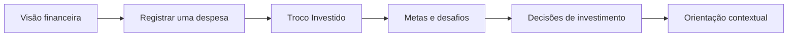
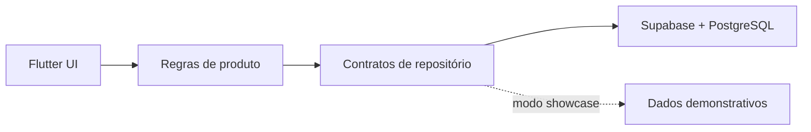

<div align="center">

# FinFlow Showcase

### Transforme números dispersos em clareza financeira — e clareza em ação.

Uma experiência de finanças pessoais que conecta **saldo, hábitos, metas e investimentos** em uma jornada visual, simples e orientada ao próximo passo.

<p>
  <a href="https://teixeirads.github.io/FinFlow-Showcase/">
    
  </a>
</p>

<p>
  
  
  
  
</p>

<sub>Sem cadastro. Sem dados bancários reais. Abra, explore e entenda o produto em poucos minutos.</sub>

</div>

---

## Veja em ação

O FinFlow foi desenhado para responder rapidamente às três perguntas que mais importam: **quanto eu tenho, como estou evoluindo e qual deve ser meu próximo passo?**



| 01 · Início | 02 · Troco | 03 · Desafios | 04 · Investimentos | 05 · Consultor |
| :---: | :---: | :---: | :---: | :---: |
| Saldo, score e resumo mensal | Pequenos valores viram hábito | Progresso que motiva | Metas, carteira e comparativos | Próximos passos em linguagem simples |

<div align="center">
  <a href="https://teixeirads.github.io/FinFlow-Showcase/#/home"><strong>Começar pelo dashboard →</strong></a>
</div>

<!-- VISUAL SHOWCASE — PLACEHOLDERS PRONTOS PARA A PRÓXIMA CAPTURA

Salve os arquivos em docs/media/ para que sejam versionados no repositório público:

1. finflow-overview.gif      — jornada de 12–18 s: Início → Troco → Desafios → Investimentos → IA
2. finflow-dashboard.webp    — saldo, FinFlow Score, resumo mensal e ações rápidas
3. finflow-challenges.webp   — desafio semanal, checklist, XP e progresso
4. finflow-investments.webp  — metas, comparativos e sugestões por prazo
5. finflow-consultant.webp   — prompts rápidos e conversa contextual demonstrativa

Recomendação: 1440 × 900 px para desktop ou 430 × 932 px para mobile; WebP para imagens
e GIF otimizado abaixo de 8 MB. Quando os arquivos existirem, mova o bloco abaixo para
fora deste comentário:

<p align="center">
  
</p>

<table>
  <tr>
    <td></td>
    <td></td>
  </tr>
  <tr>
    <td></td>
    <td></td>
  </tr>
</table>

-->

---

## Por que o FinFlow?

Ver o saldo não significa compreender o próprio dinheiro. Quando gastos, metas e investimentos vivem em telas desconectadas, o usuário recebe muitos números — mas pouca direção.

| O problema | A solução | O resultado |
| :--- | :--- | :--- |
| Registrar despesas parece trabalho e acompanhar planilhas exige disciplina constante. | O FinFlow reúne visão geral, hábitos, objetivos e decisões em um fluxo único. | Menos esforço para interpretar dados e mais confiança para escolher o próximo passo. |

O diferencial está na narrativa que conecta as experiências: despesas dão contexto ao **Troco Investido**, o progresso ganha forma nos **desafios**, os objetivos organizam **sugestões de investimento** e o consultor demonstrativo reúne esse panorama em linguagem simples. Na vitrine pública, essa jornada é apresentada com dados simulados.

---

## The Magic — funcionalidades que geram valor

| | |
| :--- | :--- |
| **Visão financeira em segundos**<br><sub>Saldo, renda, gastos, patrimônio, meta e FinFlow Score no mesmo panorama. Menos caça aos números; mais entendimento.</sub> | **Troco que constrói consistência**<br><sub>Visualize como o arredondamento de pequenas despesas pode transformar consumo cotidiano em progresso para uma meta.</sub> |
| **Gamificação com propósito**<br><sub>Desafios semanais, checklists, limites e XP convertem intenção em comportamento mensurável — sem infantilizar a experiência.</sub> | **Metas que orientam decisões**<br><sub>Reserva, casamento e carro deixam de ser desejos abstratos e passam a conduzir sugestões por prazo e objetivo.</sub> |
| **Investimentos com contexto**<br><sub>Compare carteira, CDI, Ibovespa e IFIX por período e explore alternativas com aporte mínimo e disponibilidade por instituição.</sub> | **Conversa financeira contextual**<br><sub>Um fluxo demonstrativo de consultoria reúne score, reserva e saldo livre para traduzir dados em próximos passos compreensíveis.</sub> |

### Decisões de UX que sustentam a experiência

- **Divulgação progressiva:** primeiro o essencial; detalhes e comparativos aparecem quando ajudam a decidir.
- **Ação junto ao contexto:** registrar, comparar ou explorar uma meta acontece perto do dado que motivou a ação.
- **Feedback quantificado:** barras, percentuais, limites e marcos tornam o progresso tangível.
- **Navegação consistente:** cinco áreas principais permanecem acessíveis pela barra inferior.
- **Layout responsivo:** a experiência se reorganiza para diferentes larguras de tela.

---

## Tech Stack

<div align="center">
  
  
  
  
  
</div>

| Camada | Escolha técnica | Papel no produto |
| :--- | :--- | :--- |
| **Experiência** | Flutter + Dart | Interface multiplataforma, responsiva e orientada a componentes. |
| **Dados** | Supabase + PostgreSQL | Autenticação, persistência e serviços de backend na solução principal. |
| **Arquitetura** | Clean Architecture + Repository Pattern | Separação entre regras de negócio, dados e interface no código-fonte privado. |
| **Showcase** | Flutter Web + GitHub Pages | Distribuição pública em Demo Mode, com navegação sem cadastro e dados demonstrativos. |



> **Decisão de arquitetura:** a experiência pública opera em Demo Mode e apresenta dados simulados para permitir a avaliação sem cadastro. O código-fonte principal e a arquitetura de banco permanecem em um repositório privado.

---

## Quick Start

### Opção 1 — experimentar agora

Não há instalação, login ou configuração:

1. Acesse a [Live Demo do FinFlow](https://teixeirads.github.io/FinFlow-Showcase/).
2. Navegue por **Início**, **Troco**, **Desafios**, **Investimentos** e **IA**.
3. Use os dados demonstrativos para avaliar os fluxos, a hierarquia visual e as decisões de produto.

### Opção 2 — executar o build público localmente

Pré-requisitos: Git e Python 3.

```bash
mkdir finflow-preview
cd finflow-preview
git clone --branch gh-pages --single-branch https://github.com/teixeirads/FinFlow-Showcase.git FinFlow-Showcase
python -m http.server 8080
```

Depois, abra `http://localhost:8080/FinFlow-Showcase/`.

> A branch `main` documenta o produto; a branch `gh-pages` contém o build web publicado. O código-fonte Flutter completo não faz parte deste repositório público.

---

## Escopo da demonstração

| Disponível para explorar | Em evolução |
| :--- | :--- |
| Dashboard, registro de despesa, Troco Investido, desafios, investimentos e consultor contextual demonstrativo. | Poder de compra, perfil, notificações e fluxos completos de metas. |

Todos os nomes, saldos, rendimentos, indicadores e recomendações exibidos são **dados simulados para demonstração de produto**. O conteúdo não representa cotação em tempo real nem recomendação financeira.

---

## Feedback e contribuição

Este repositório público é a vitrine do FinFlow. Feedbacks sobre **UX, acessibilidade, responsividade, conteúdo e clareza da demonstração** são bem-vindos.

- Encontrou um problema? [Abra uma issue](https://github.com/teixeirads/FinFlow-Showcase/issues).
- Quer conversar sobre a arquitetura ou colaborar com o produto? Entre em contato pelos canais abaixo.

---

<div align="center">

Desenvolvido por **Davi de Souza Teixeira**

[Portfólio](https://teixeirads.github.io/Portfolio/) · [LinkedIn](https://www.linkedin.com/in/teixeiradss) · [GitHub](https://github.com/teixeirads)

<sub>Produto, engenharia e experiência pensados para transformar informação financeira em decisão.</sub>

</div>
